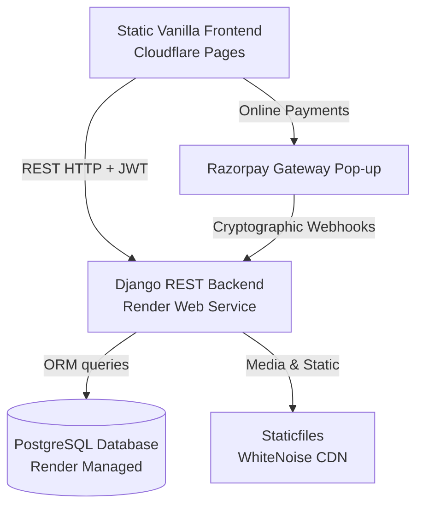

# Mahi Solar — Enterprise Renewable Energy Platform

A high-performance, cinematic, and completely decoupled full-stack e-commerce and energy assessment platform for **Mahi Solar**. 

The architecture is built to mirror premium product experiences (Tesla, Apple, Stripe) utilizing a vanilla HTML5/CSS3/ES6 frontend and a robust Django REST API backend.

---

## 🗺️ System Architecture



- **Frontend**: HTML5, ES6 JavaScript, and Vanilla CSS with custom glassmorphism visual layout tokens. Asynchronous backend interactions via fetch API and localized authentication state management.
- **Backend**: Django & Django REST Framework (DRF) handling user profiles, dynamic catalog filtering, shopping carts, site visit bookings, solar calculation algorithms, and payment verifications.

---

## 📂 Project Structure

```
mahi-solar/
├── frontend/                     # Static Frontend Layer
│   ├── pages/                    # Webpage Layouts (index, products, cart, etc.)
│   ├── css/                      # Modular style sheets (variables, global, navbar, animations)
│   ├── js/                       # Modular Component, Page-level scripts & State Managers
│   └── assets/                   # High-Fidelity 3D GLB Models, Icons, and Media
├── backend/                      # Django REST API Layer
│   ├── apps/                     # Core Business Applications (accounts, products, orders, leads, blog)
│   ├── config/                   # Global configuration and setting configurations (base.py)
│   ├── core/                     # Empty Core directory for shared validators and utilities
│   ├── requirements.txt          # Python Dependency Registry
│   ├── render.yaml               # Infrastructure-as-Code Setup for Render Cloud
│   └── build.sh                  # Automation build pipelines for Render
├── database/                     # Fixtures & Backup storage
│   └── seeds/                    # Seed configurations (categories, products, blog posts)
├── docs/                         # Extended Architectural & Guide Docs
└── README.md                     # Master Documentation
```

---

## ⚡ Quick Start (Local Development)

### 1. Prerequisite Checklist
Ensure you have the following installed:
- Python 3.10+
- Modern Web Browser (Chrome, Edge, Firefox, Safari)

---

### 2. Backend API Setup

1. **Navigate to the backend directory**:
   ```bash
   cd backend
   ```

2. **Install dependencies**:
   ```bash
   pip install -r requirements.txt
   ```

3. **Initialize the local database**:
   ```bash
   python manage.py migrate
   ```

4. **Seed database fixtures**:
   Ensure you populate blog posts and categories correctly:
   ```bash
   python manage.py loaddata ../database/seeds/blog_posts.json
   ```
   *(Note: The database comes with pre-populated Categories and Products out-of-the-box!)*

5. **Start the Django backend server**:
   ```bash
   python manage.py runserver
   ```
   The backend API will start on: `http://127.0.0.1:8000/`

---

### 3. Frontend Web Client Setup

1. **Launch a local server** (e.g. VS Code Live Server, python http.server, or double-click to view):
   ```bash
   # From root or frontend directory
   python -m http.server 5500
   ```
2. Open the browser to: `http://127.0.0.1:5500/frontend/pages/index.html`

---

## 🧪 Automated Testing & QA

Run the integrated transaction, authentication, and lead generation API test suite to verify endpoint stability:

```bash
cd backend
python manage.py test accounts
```

### Verified Scenarios:
- **Registration & Token Issuance**: Verifies user creation and session keys.
- **Profile Updates**: Verifies GET/POST updates on UserProfile objects.
- **Product Catalog Search**: Asserts correct catalog listings and detail slugs.
- **Contact & Appointment Bookings**: Verifies schema integrity for leads.
- **E-Commerce Checkout & Cancel**: Exercises cart instantiation, checkout calculation, order placement, and cancellation lifecycles.

---

## 🚀 Deployment Configurations

### Backend Deployments (Render.com)
The platform is ready for one-click deployment using `render.yaml`. Connect your GitHub repository to Render and it will automatically provision:
1. **Render PostgreSQL Database** (Free Plan)
2. **Render Web Service** (Python runtime running Gunicorn)

**Build and Start Commands** are automatically loaded from `render.yaml`:
- **Build Command**: `./build.sh` (Installs dependencies, compiles static assets, and runs database migrations)
- **Start Command**: `gunicorn config.wsgi:application`

### Frontend Deployments (Cloudflare Pages)
Connect the `frontend/` directory to **Cloudflare Pages**:
- **Framework Preset**: None (Static HTML/JS)
- **Build Command**: None
- **Build Output Directory**: `/` (or root of frontend directory)
- **Redirects & Headers**: Handled natively via `/public/_headers` and `/public/_redirects` to route SPA paths and secure CORS origins.

## 🔌 API Reference

Base URL: `http://127.0.0.1:8000/api/`

| Domain | Methods | Notes |
|--------|---------|-------|
| `/api/products/` | GET list, GET detail by slug | Supports `?category=`, `?q=`, `?min_price=`, `?max_price=` |
| `/api/products/featured/` | GET | Featured catalog subset |
| `/api/categories/` | GET list, GET detail by slug | Active categories |
| `/api/cart/` | GET, POST `add_item` | Authenticated user cart |
| `/api/orders/` | GET list, GET detail, POST checkout, POST cancel, POST return | Authenticated user orders |
| `/api/contact/` | POST | Public lead submission |
| `/api/site-visit/` | POST | Public appointment booking |
| `/api/calculator/` | POST `calculate`, POST `save_lead` | Public solar estimator + optional lead capture |
| `/api/auth/` | POST `register`, POST `login`, POST `logout`, GET/POST `profile` | Session-based auth via DRF |

Frontend expected base: set `window.API_BASE_URL` or use `http://127.0.0.1:8000` as default API gateway.
